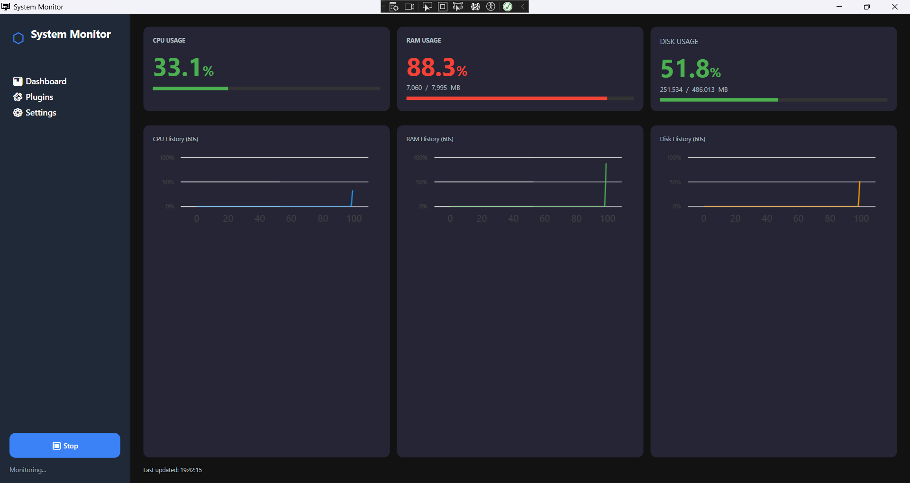
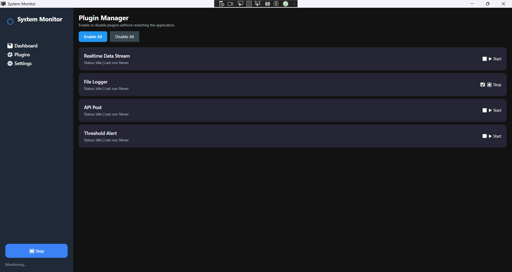
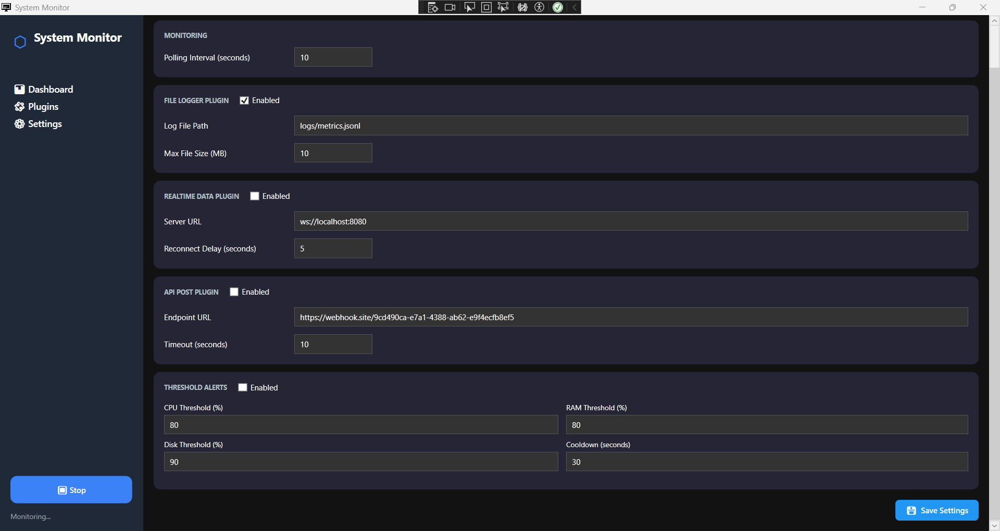
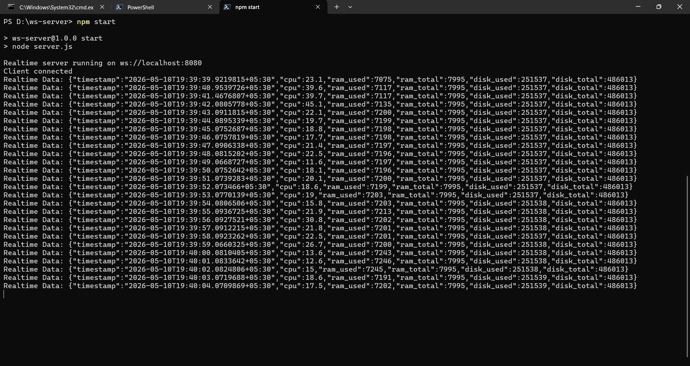

# System Monitor

A cross-platform desktop system resource monitor built with **C# / .NET 8** and **WPF**, implementing Clean Architecture, dependency injection, real-time live charts, and an extensible plugin system.

---

## Screenshots

### Dashboard
Live CPU, RAM, and Disk metrics with colour-coded gauges and rolling 60-second history charts.



### Plugin Manager
Enable or disable any plugin at runtime without restarting the application.



### Settings
All configuration values editable in-app. Changes are persisted to `appsettings.json`.



### Realtime Data Stream
WebSocket plugin streaming live metric data to an external server (`ws://localhost:8080`).



---

## Features

| Feature | Details |
|---|---|
| Live metric monitoring | CPU %, RAM used/total, Disk used/total — polled on a configurable interval |
| Rolling history charts | 60-second LiveCharts2 line chart per metric, colour-coded by severity |
| Plugin system | Four plugins, all hot-toggleable at runtime without restart |
| Realtime WebSocket stream | Streams every snapshot to a WebSocket server with auto-reconnect |
| File logger | Appends JSON lines to a local log file with configurable rotation |
| API post | HTTP POST of snapshot payload to any REST endpoint |
| Threshold alerts | Per-metric configurable thresholds with cooldown to prevent alert storms |
| Settings UI | Edit all config in-app; saved back to `appsettings.json` |
| Cross-platform structure | Windows fully implemented; Linux/macOS cleanly stubbed and documented |
| Dark UI | Clean dark-themed WPF interface with sidebar navigation |

---

## Architecture

The solution follows **Clean Architecture** — dependencies flow strictly inward, from the UI toward the domain core. Each layer has a single responsibility and no circular references exist.

```
┌─────────────────────────────────────────────────────────┐
│                    SystemMonitor.WPF                    │  Presentation (MVVM)
│         Views  •  ViewModels  •  Converters             │
└────────────────────────┬────────────────────────────────┘
                         │
┌────────────────────────▼────────────────────────────────┐
│                 SystemMonitor.AppLogic                  │  Orchestration
│          MonitoringService  •  DI Extensions            │
└──────┬─────────────────────────────────────────┬────────┘
       │                                         │
┌──────▼──────────────┐           ┌──────────────▼───────┐
│  SystemMonitor.     │           │  Plugins             │
│  Infrastructure     │           │  ├── FileLogger       │
│  ├── Windows        │           │  ├── ApiPost          │
│  ├── Linux (stub)   │           │  ├── RealtimeData     │
│  └── macOS (stub)   │           │  └── ThresholdAlert   │
└──────┬──────────────┘           └──────────────┬───────┘
       │                                         │
┌──────▼─────────────────────────────────────────▼───────┐
│                   SystemMonitor.Core                    │  Domain (no deps)
│   ISystemMetricsProvider  •  IMonitorPlugin             │
│   IMonitoringService  •  SystemSnapshot  •  Metrics     │
└─────────────────────────────────────────────────────────┘
```

### Dependency Rule

`Core` has **zero** external or project references. Every other layer references Core and nothing flows back outward. Adding a new platform provider or a new plugin never requires changes to the Core or AppLogic layers.

---

## Project Structure

```
SystemMonitor.sln
├── src/
│   ├── SystemMonitor.Core/               # Interfaces + immutable domain models
│   │   ├── Interfaces/
│   │   │   ├── ISystemMetricsProvider.cs
│   │   │   ├── IMonitorPlugin.cs
│   │   │   └── IMonitoringService.cs
│   │   └── Models/
│   │       ├── SystemSnapshot.cs         # Immutable record; derived RamPercent/DiskPercent
│   │       └── Metrics.cs                # MemoryMetrics, DiskMetrics records
│   │
│   ├── SystemMonitor.Infrastructure/     # Platform-specific metric collection
│   │   └── Providers/
│   │       ├── WindowsMetricsProvider.cs # PerformanceCounter + GlobalMemoryStatusEx P/Invoke
│   │       ├── LinuxMetricsProvider.cs   # Documented stub (/proc/stat, /proc/meminfo)
│   │       ├── MacOsMetricsProvider.cs   # Documented stub (sysctl, vm_stat)
│   │       └── MetricsProviderFactory.cs # Runtime OS selection via RuntimeInformation
│   │
│   ├── SystemMonitor.AppLogic/           # Service orchestration + DI wiring
│   │   ├── MonitoringService.cs          # PeriodicTimer loop, plugin dispatch, events
│   │   ├── Configuration/
│   │   │   └── MonitoringOptions.cs
│   │   └── Extensions/
│   │       └── ServiceCollectionExtensions.cs
│   │
│   └── SystemMonitor.WPF/                # WPF presentation layer (MVVM)
│       ├── ViewModels/
│       │   ├── MainViewModel.cs          # Navigation + service lifecycle
│       │   ├── DashboardViewModel.cs     # Live metrics + chart history
│       │   ├── PluginsViewModel.cs       # Plugin enable/disable management
│       │   └── SettingsViewModel.cs      # Config editing + appsettings.json save
│       ├── Views/
│       │   ├── MainWindow.xaml           # Shell + sidebar navigation
│       │   ├── DashboardView.xaml        # Metric cards + LiveCharts2 charts
│       │   ├── PluginsView.xaml          # Plugin manager
│       │   └── SettingsView.xaml         # Settings editor
│       ├── Converters/
│       │   └── Converters.cs             # PercentToColor, BoolToVisibility, MonitoringState
│       ├── Models/
│       │   └── AlertNotification.cs      # Alert toast model
│       └── appsettings.json
│
└── plugins/
    ├── SystemMonitor.Plugin.FileLogger/  # Appends JSONL to local log file
    ├── SystemMonitor.Plugin.ApiPost/     # HTTP POST to configurable REST endpoint
    ├── SystemMonitor.Plugin.RealtimeData/# WebSocket stream to external server
    └── SystemMonitor.Plugin.ThresholdAlert/ # Fires alerts when thresholds exceeded
```

---

## Plugin System

Each plugin implements `IMonitorPlugin` from Core and is registered with the DI container. `MonitoringService` dispatches to all enabled plugins concurrently via `Task.WhenAll` on every polling tick. A plugin exception is caught individually — one failing plugin never crashes the loop or affects others.

| Plugin | Protocol | Description |
|---|---|---|
| **File Logger** | File I/O | Appends every snapshot as a JSON line. Supports log rotation by file size. |
| **API Post** | HTTP POST | Posts `{cpu, ram_used, disk_used}` payload to a configurable REST endpoint. |
| **Realtime Data Stream** | WebSocket | Streams full snapshot JSON to `ws://localhost:8080` with configurable reconnect delay. |
| **Threshold Alert** | In-process event | Fires an alert when CPU, RAM, or Disk exceeds configured %. Per-metric cooldown prevents alert storms. |

## Realtime WebSocket Plugin

The `RealtimeDataPlugin` maintains a persistent WebSocket connection to an external server and streams every snapshot in real time. If the connection drops, it reconnects automatically after a configurable delay. This makes it suitable for piping live data into dashboards, databases, or monitoring stacks.

### A simple Node.js WebSocket server can be used for testing.
To run a test WebSocket server locally:

**server.js:**

```js
const WebSocket = require('ws');

const server = new WebSocket.Server({
    port: 8080
});

console.log('Realtime server running on ws://localhost:8080');

server.on('connection', socket => {

    console.log('Client connected');

    socket.on('message', message => {

        console.log(
            'Realtime Data:',
            message.toString());

    });

});
```

```bash
cd ws-server
npm install
npm start
# Server starts at ws://localhost:8080
```

---

## Cross-Platform Strategy

Platform-specific code is isolated entirely within `SystemMonitor.Infrastructure`. The `MetricsProviderFactory` selects the correct provider once at startup using `RuntimeInformation.IsOSPlatform()`:

```csharp
public static ISystemMetricsProvider Create()
{
    if (RuntimeInformation.IsOSPlatform(OSPlatform.Windows)) return new WindowsMetricsProvider();
    if (RuntimeInformation.IsOSPlatform(OSPlatform.Linux))   return new LinuxMetricsProvider();
    if (RuntimeInformation.IsOSPlatform(OSPlatform.OSX))     return new MacOsMetricsProvider();
    throw new PlatformNotSupportedException(...);
}
```

Nothing else in the codebase references any concrete provider. Adding a new platform means adding one class and one line in the factory — zero changes to Core, AppLogic, Plugins, or WPF.

| Metric | Windows | Linux | macOS |
|---|---|---|---|
| CPU | `PerformanceCounter` — `% Processor Time` | `/proc/stat` delta *(stub)* | `sysctl vm.loadavg` *(stub)* |
| RAM | `GlobalMemoryStatusEx` P/Invoke | `/proc/meminfo` MemAvailable *(stub)* | `sysctl hw.memsize` + `vm_stat` *(stub)* |
| Disk | `DriveInfo` *(cross-platform)* | `DriveInfo` *(cross-platform)* | `DriveInfo` *(cross-platform)* |

> The `[SupportedOSPlatform("windows")]` attribute on `WindowsMetricsProvider` causes the Roslyn analyser to emit a build warning if any Windows-only API is accidentally referenced on another platform.

---

## Prerequisites

| Requirement | Version |
|---|---|
| .NET SDK | 8.0 or later |
| Visual Studio | 2022 v17.8+ (recommended) |
| VS Code | with C# Dev Kit extension |
| OS | Windows 10 / 11 (full support) |
| Node.js | 18+ *(optional — only for WebSocket test server)* |

---

## Building & Running

### Visual Studio 2022

```
1. Open SystemMonitor.sln
2. Right-click SystemMonitor.WPF → Set as Startup Project
3. Press F5 to run with debugger, or Ctrl+F5 without
```

### Command Line

```bash
# Clone the repository
git clone https://github.com/TheAnkitGautam/System-Monitor-App.git
cd SystemMonitor

# Restore all NuGet packages
dotnet restore

# Build the entire solution
dotnet build

# Run the WPF application (Windows only)
dotnet run --project src/SystemMonitor.WPF/SystemMonitor.WPF.csproj
```

---

## Configuration

All settings live in `src/SystemMonitor.WPF/appsettings.json` and can also be edited through the **Settings** tab while the app is running. Click **Save Settings** to persist changes to disk.

```json
{
  "Monitoring": {
    "IntervalSeconds": 5
  },
  "Plugins": {
    "FileLogger": {
      "Enabled": true,
      "FilePath": "logs/metrics.jsonl",
      "MaxFileSizeMb": 10
    },
    "RealtimeData": {
      "Enabled": false,
      "ServerUrl": "ws://localhost:8080",
      "ReconnectDelaySeconds": 5
    },
    "ApiPost": {
      "Enabled": false,
      "Endpoint": "https://your-api.example.com/metrics",
      "TimeoutSeconds": 10
    },
    "ThresholdAlert": {
      "Enabled": true,
      "CpuThreshold": 80,
      "RamThresholdPercent": 85,
      "DiskThresholdPercent": 90,
      "CooldownSeconds": 30
    }
  }
}
```

### API Post Payload Format

The API Post plugin sends the following JSON body on every tick:

```json
{
  "cpu": 33.1,
  "ram_used": 7060,
  "disk_used": 251534
}
```

### WebSocket Stream Payload Format

The Realtime Data plugin sends the full snapshot:

```json
{
  "timestamp": "2026-05-10T19:39:40.953+05:30",
  "cpu": 39.6,
  "ram_used": 7117,
  "ram_total": 7995,
  "disk_used": 251537,
  "disk_total": 486013
}
```